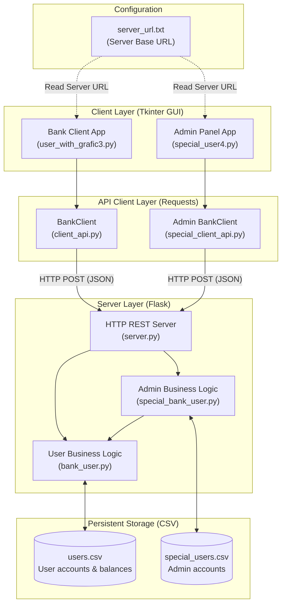

# Banking System

A comprehensive banking system built using a client-server architecture in **Python**, utilizing **Flask** as the backend REST API and **Tkinter** for the graphical user interface (GUI) for both clients and administrators. User accounts and administrator credentials are persisted in CSV files, and the server address is configured centrally via `server_url.txt`.

---

## Table of Contents
1. [System Architecture](#-system-architecture)
2. [Project Structure and Files](#-project-structure-and-files)
3. [Server URL Configuration (server_url.txt)](#-server-url-configuration-server_urltxt)
4. [REST API Specification](#-rest-api-specification)
5. [Database (CSV Files)](#-database-csv-files)
6. [Requirements and Installation](#-requirements-and-installation)
7. [Getting Started / Running the Project](#-getting-started--running-the-project)
8. [Network Configuration (LAN / Wi-Fi / Localhost)](#-network-configuration-lan--wi-fi--localhost)
9. [Security and Future Improvements](#-security-and-future-improvements)

---

## System Architecture

The system is based on a three-tier application architecture:
1. **Frontend (GUI - Tkinter):** Desktop applications for standard users and administrators. On startup, they read the backend URL from `server_url.txt`.
2. **API Client Layer (Requests):** Intermediate classes (`BankClient`) translating UI user actions into HTTP POST requests formatted in JSON.
3. **Backend (Flask + Business Logic):** A REST API server that processes requests and manages account states persisted in CSV files.



---

## Project Structure and Files

### 1. `server.py`
The primary backend entry point running on the **Flask** framework on port `5000` (`0.0.0.0:5000`).
* Instantiates `BankUser` and `SpecialBankUser(bank_user)`.
* Registers HTTP routes and maps incoming JSON requests to business logic methods.
* Handles diagnostic requests (`GET /`) and core business operations (`POST`).

### 2. `bank_user.py`
Contains the `BankUser` class responsible for client account operations and direct storage operations on `users.csv`:
* `load_users()`: Reads user accounts from the CSV file into an in-memory dictionary.
* `save_users()`: Saves the current state of all accounts and balances back to `users.csv`.
* `login(username, password)`: Verifies user login credentials.
* `balance(username, password)`: Returns the current balance for an authenticated user.
* `transfer(username, password, amount, from_, to)`: Validates available funds and executes a transfer between accounts.

### 3. `special_bank_user.py`
Contains the `SpecialBankUser` class responsible for administrative privileges:
* Holds a reference to the `bank_user` instance, enabling direct modifications to client accounts.
* `load_special_users()`: Loads administrator credentials from `special_users.csv`.
* `login(username, password)`: Verifies administrator credentials.
* `check_users(username, password)`: Generates a formatted text list of all users and their respective balances.
* `deposit(username, password, amount, username2)`: Deposits funds into a target client's account.
* `withdraw(username, password, amount, username2)`: Withdraws funds from a target client's account (with balance check).
* `add_user(username, password, new_username, new_password)`: Creates a new user account initialized with a balance of 0.
* `cancel_user(username, password, old_username)`: Deletes the specified user account.

### 4. `client_api.py` (or `client-api.py`)
HTTP client module for standard users (`BankClient` class):
* Acts as an intermediary between the Tkinter GUI and the Flask server using the `requests` library.
* Stores session state (`username` and `password`) after successful authentication.
* Methods: `login(username, password)`, `get_balance()`, `transfer(to_user, amount)`.

### 5. `special_client_api.py`
HTTP client module for the administrator panel (`BankClient` class):
* Facilitates communication between the administrative panel and administrative endpoints.
* Methods: `special_login(username, password)`, `deposit(amount, username2)`, `withdraw(amount, username2)`, `add_user(new_username, new_password)`, `cancel_user(old_username)`, `check_users()`.

### 6. `user_with_grafic3.py`
Desktop client application built with **Tkinter**:
* **Dynamic address configuration:** Reads the server URL from `server_url.txt` at startup and passes it to the `BankApp(server_url)` constructor.
* Constructor `BankApp(self, server_url)` instantiates the client: `self.client = BankClient(server_url)`.
* Multi-frame navigation model (Frame switching):
  * Login screen (`login_frame`)
  * Main menu / Dashboard (`menu_frame`): shows current balance, navigation buttons
  * Transfer screen (`transfer_frame`): inputs for amount and recipient
  * Confirmation screen (`done_transfer_frame`): operation status message
  * Logout screen (`logout_frame`)

### 7. `special_user4.py`
Desktop administrator application (**Tkinter**):
* **Dynamic address configuration:** Reads the server URL from `server_url.txt` at startup and passes it to the `BankApp(server_url)` constructor.
* Constructor `BankApp(self, server_url)` instantiates the admin client: `self.client = BankClient(server_url)`.
* Persistent user account and balance display (`app_element_frame`).
* Administrative operations menu:
  * Add user (`adding_user_frame`)
  * Delete user (`deleting_user_frame`)
  * Deposit funds (`deposit_menu_frame`)
  * Withdraw funds (`withdraw_menu_frame`)
  * Operation confirmation (`done_action_frame`)

### 8. `server_url.txt`
Configuration file containing the server base URL (e.g. `http://127.0.0.1:5000`). Allows switching server addresses for all client applications without modifying Python source code.

---

## ⚙ Server URL Configuration (`server_url.txt`)

To streamline working in different environments (localhost, Wi-Fi/LAN, cloud), client applications read the base server URL from `server_url.txt`:

```text
http://127.0.0.1:5000
```

Code snippet responsible for loading the URL in `user_with_grafic3.py` and `special_user4.py`:
```python
with open("server_url.txt", "r", encoding="utf-8") as file:
    url = file.read().strip()

app = BankApp(url)
```

To switch servers, simply edit the text in `server_url.txt`.

---

## REST API Specification

All requests send and receive JSON data (`Content-Type: application/json`).

| Method | Endpoint | Required JSON Parameters | Description |
|---|---|---|---|
| `GET` | `/` | *None* | Health check / server status |
| `POST` | `/login` | `username`, `password` | Standard user login |
| `POST` | `/balance` | `username`, `password` | Retrieve balance for authenticated user |
| `POST` | `/transfer` | `username`, `password`, `amount`, `from_`, `to` | Transfer funds to another account |
| `POST` | `/special_login` | `username`, `password` | Administrator login |
| `POST` | `/users` | `username`, `password` | Get list of all clients with balances |
| `POST` | `/add_user` | `username`, `password`, `new_username`, `new_password` | Register a new user |
| `POST` | `/cancel_user` | `username`, `password`, `old_username` | Remove an existing user |
| `POST` | `/deposit` | `username`, `password`, `amount`, `username2` | Deposit cash into client account |
| `POST` | `/withdraw` | `username`, `password`, `amount`, `username2` | Withdraw cash from client account |

---

## Database (CSV Files)

Plain text CSV files encoded in UTF-8 are used for data persistence:

### `users.csv`
Stores regular user accounts and balances:
```csv
username,password,balance
adam,1234,3000.0
ewa,abcd,1000.0
dino,red,200.0
```

### `special_users.csv`
Stores authorized administrator accounts:
```csv
username,password
admin,admin
adam,1234
```

---

## Requirements and Installation

### System Requirements
* Python **3.10+** (recommended 3.11 or newer)
* Built-in `tkinter` module (included by default with standard Python installations on Windows)

### Installing Dependencies
From the project root directory, install required packages:
```bash
pip install -r requirements.txt
```

Contents of `requirements.txt`:
* `flask~=3.1.1` – backend API server
* `requests~=2.32.4` – HTTP client library

---

## Getting Started / Running the Project

### Step 1: Start the Backend Server
In the first terminal window:
```bash
python server.py
```
The server listens by default on `http://0.0.0.0:5000/`.

### Step 2: Launch the Administrator Panel
In a second terminal window:
```bash
python special_user4.py
```
* Default admin credentials: `admin` / `admin`.

### Step 3: Launch the Client Application
In a third terminal window:
```bash
python user_with_grafic3.py
```
* Example client credentials: `adam` / `1234`.

---

## Network Configuration (LAN / Wi-Fi / Localhost)

Thanks to `server_url.txt`, network configuration does not require editing any `.py` files:

* **Local single-machine execution (Localhost):**
  Set `server_url.txt` to:
  ```text
  http://127.0.0.1:5000
  ```

* **Local network / Wi-Fi execution (multiple machines):**
  1. Determine the local IP of the server machine using `ipconfig` (e.g. `192.168.1.105`).
  2. Make sure port `5000` is allowed through the Windows Defender Firewall.
  3. On client machines, enter that URL in `server_url.txt`:
     ```text
     http://192.168.1.105:5000
     ```

---

## Security and Future Improvements

In its current state, this project is designed for educational/demonstration purposes. For production readiness, the following enhancements are advised:
1. **Password Hashing:** Use secure hashing algorithms such as `bcrypt` or `Argon2` instead of storing plain-text passwords.
2. **Session Authentication:** Replace sending credentials in every request with JWT (JSON Web Tokens) or session cookies marked `HttpOnly`.
3. **Encrypted Transport:** Enforce HTTPS / TLS encryption to protect data in transit across local and public networks.
4. **Relational Database:** Migrate from CSV files to an ACID-compliant database (such as SQLite or PostgreSQL) to prevent race conditions during concurrent client operations.

---

## Author
Created by Adam Buczek | Adix Labs

https://github.com/adixlabs
