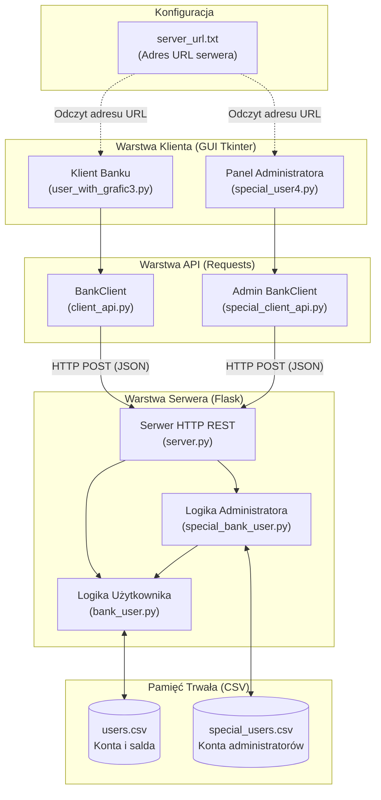

# System Bankowy

Kompleksowy system bankowy zrealizowany w architekturze klient-serwer w języku **Python**, wykorzystujący **Flask** jako backend API oraz **Tkinter** do obsługi graficznego interfejsu użytkownika (GUI) dla klientów i administratorów. Dane użytkowników oraz administratorów przechowywane są w plikach CSV, a adres serwera konfigurowany jest centralnie w pliku tekstowym `server_url.txt`.

---

## Spis treści
1. [Architektura systemu](#-architektura-systemu)
2. [Struktura i pliki projektu](#-struktura-i-pliki-projektu)
3. [Konfiguracja adresu serwera (server_url.txt)](#-konfiguracja-adresu-serwera-server_urltxt)
4. [Specyfikacja API REST](#-specyfikacja-api-rest)
5. [Baza danych (Pliki CSV)](#-baza-danych-pliki-csv)
6. [Wymagania i instalacja](#-wymagania-i-instalacja)
7. [Instrukcja uruchomienia](#-instrukcja-uruchomienia)
8. [Konfiguracja sieciowa (LAN / Wi-Fi / Localhost)](#-konfiguracja-sieciowa-lan--wi-fi--localhost)
9. [Bezpieczeństwo i możliwe usprawnienia](#-bezpieczeństwo-i-możliwe-usprawnienia)

---

## Architektura systemu

System oparty jest na trójwarstwowym modelu aplikacji:
1. **Frontend (GUI - Tkinter):** Aplikacje okienkowe dla użytkownika standardowego oraz administratora. Pobierają adres URL backendu z pliku `server_url.txt`.
2. **Warstwa klienta API (Requests):** Klasy pośredniczące (`BankClient`) tłumaczące akcje interfejsu na zapytania HTTP POST w formacie JSON.
3. **Backend (Flask + Logika biznesowa):** Serwer REST API przetwarzający żądania i zarządzający stanem kont w plikach CSV.



---

## 📁 Struktura i pliki projektu

### 1. `server.py`
Główny punkt wejściowy backendu uruchamiany we frameworku **Flask** na porcie `5000` (`0.0.0.0:5000`).
* Inicjalizuje obiekty `BankUser` oraz `SpecialBankUser(bank_user)`.
* Rejestruje trasy HTTP i mapuje zapytania JSON na metody klas biznesowych.
* Obsługuje zapytania diagnostyczne (`GET /`) oraz operacje biznesowe (`POST`).

### 2. `bank_user.py`
Zawiera klasę `BankUser` odpowiadającą za operacje na kontach standardowych klientów oraz bezpośredni dostęp do bazy `users.csv`:
* `load_users()`: Odczytuje bazę kont z pliku CSV do słownika w pamięci RAM.
* `save_users()`: Zapisuje bieżący stan wszystkich kont i sald do `users.csv`.
* `login(username, password)`: Weryfikacja danych logowania klienta.
* `balance(username, password)`: Zwraca aktualne saldo zalogowanego użytkownika.
* `transfer(username, password, amount, from_, to)`: Waliduje środki i realizuje przelew między rachunkami.

### 3. `special_bank_user.py`
Zawiera klasę `SpecialBankUser` odpowiadającą za uprawnienia administracyjne:
* Przyjmuje referencję do instancji `bank_user`, co pozwala na bezpośrednie modyfikowanie kont klientów.
* `load_special_users()`: Odczytuje dane administratorów z `special_users.csv`.
* `login(username, password)`: Weryfikacja uprawnień administratora.
* `check_users(username, password)`: Generuje sformatowaną listę wszystkich użytkowników wraz z ich saldami.
* `deposit(username, password, amount, username2)`: Wpłata środków na konto wybranego klienta.
* `withdraw(username, password, amount, username2)`: Wypłata środków z konta klienta (z weryfikacją dostępnego salda).
* `add_user(username, password, new_username, new_password)`: Utworzenie nowego konta klienta z saldem początkowym 0.
* `cancel_user(username, password, old_username)`: Usunięcie konta wskazanego klienta.

### 4. `client_api.py`
Moduł klienta HTTP dla standardowego użytkownika (klasa `BankClient`):
* Pośredniczy pomiędzy GUI a serwerem Flask za pomocą biblioteki `requests`.
* Przechowuje sesję (`username` i `password`) po udanym uwierzytelnieniu.
* Metody: `login(username, password)`, `get_balance()`, `transfer(to_user, amount)`.

### 5. `special_client_api.py`
Moduł klienta HTTP dla panelu administratora (klasa `BankClient`):
* Umożliwia komunikację panelu zarządczego z dedykowanymi endpointami administracyjnymi.
* Metody: `special_login(username, password)`, `deposit(amount, username2)`, `withdraw(amount, username2)`, `add_user(new_username, new_password)`, `cancel_user(old_username)`, `check_users()`.

### 6. `user_with_grafic3.py`
Aplikacja desktopowa dla klienta banku stworzona w bibliotece **Tkinter**:
* **Dynamiczna konfiguracja adresu:** Przy starcie odczytuje adres serwera z pliku `server_url.txt` i przekazuje go do konstruktora `BankApp(server_url)`.
* Konstruktor `BankApp(self, server_url)` inicjalizuje klienta: `self.client = BankClient(server_url)`.
* Dynamiczne przełączanie widoków (Frame switching):
  * Ekran logowania (`login_frame`)
  * Menu główne (`menu_frame`): podgląd aktualnego salda, nawigacja
  * Formularz przelewu (`transfer_frame`): wprowadzanie kwoty i odbiorcy
  * Ekran potwierdzenia (`done_transfer_frame`): wynik operacji
  * Ekran wylogowania (`logout_frame`)

### 7. `special_user4.py`
Aplikacja desktopowa dla administratora banku (**Tkinter**):
* **Dynamiczna konfiguracja adresu:** Przy starcie odczytuje adres serwera z pliku `server_url.txt` i przekazuje go do konstruktora `BankApp(server_url)`.
* Konstruktor `BankApp(self, server_url)` inicjalizuje klienta administracyjnego: `self.client = BankClient(server_url)`.
* Stały podgląd listy użytkowników i ich aktualnych sald w czasie rzeczywistym (`app_element_frame`).
* Menu operacji bankierskich:
  * Dodawanie nowego użytkownika (`adding_user_frame`)
  * Usuwanie użytkownika (`deleting_user_frame`)
  * Wpłata środków na konto klienta (`deposit_menu_frame`)
  * Wypłata środków z konta klienta (`withdraw_menu_frame`)
  * Potwierdzenie statusu operacji (`done_action_frame`)

### 8. `server_url.txt`
Plik konfiguracyjny zawierający adres URL serwera (np. `http://127.0.0.1:5000`). Pozwala zmienić adres serwera dla wszystkich aplikacji klienckich bez modyfikowania kodu źródłowego.

---

## Konfiguracja adresu serwera (`server_url.txt`)

W celu ułatwienia pracy w różnych środowiskach (localhost, sieć Wi-Fi/LAN, chmura), aplikacje klienckie odczytują adres bazowy serwera z pliku `server_url.txt`:

```text
http://127.0.0.1:5000
```

Fragment kodu odpowiedzialny za ładowanie adresu w `user_with_grafic3.py` oraz `special_user4.py`:
```python
with open("server_url.txt", "r", encoding="utf-8") as file:
    url = file.read().strip()

app = BankApp(url)
```

Aby zmienić serwer, wystarczy zmodyfikować zawartość pliku `server_url.txt`.

---

## Specyfikacja API REST

Wszystkie zapytania przesyłają i odbierają dane w formacie JSON (`Content-Type: application/json`).

| Metoda | Endpoint | Wymagane parametry w JSON | Opis |
|---|---|---|---|
| `GET` | `/` | *Brak* | Status działania serwera |
| `POST` | `/login` | `username`, `password` | Logowanie standardowego użytkownika |
| `POST` | `/balance` | `username`, `password` | Sprawdzenie salda zalogowanego użytkownika |
| `POST` | `/transfer` | `username`, `password`, `amount`, `from_`, `to` | Przelew środków na inne konto |
| `POST` | `/special_login` | `username`, `password` | Logowanie do panelu administratora |
| `POST` | `/users` | `username`, `password` | Pobranie listy klientów z saldami |
| `POST` | `/add_user` | `username`, `password`, `new_username`, `new_password` | Utworzenie nowego użytkownika |
| `POST` | `/cancel_user` | `username`, `password`, `old_username` | Usunięcie konta użytkownika |
| `POST` | `/deposit` | `username`, `password`, `amount`, `username2` | Wpłata gotówki na konto klienta |
| `POST` | `/withdraw` | `username`, `password`, `amount`, `username2` | Wypłata gotówki z konta klienta |

---

## Baza danych (Pliki CSV)

Do przechowywania stanu kont i użytkowników wykorzystywane są pliki tekstowe w formacie CSV:

### `users.csv`
Przechowuje konta klientów:
```csv
username,password,balance
adam,1234,3000.0
ewa,abcd,1000.0
dino,red,200.0
```

### `special_users.csv`
Przechowuje uprawnionych administratorów:
```csv
username,password
admin,admin
adam,1234
```

---

## Wymagania i instalacja

### Wymagania systemowe
* Python w wersji **3.10+** (zalecany 3.11 lub nowszy)
* Standardowa biblioteka `tkinter` (dostępna domyślnie z instalatorem Pythona na Windows)

### Instalacja zależności
W katalogu projektu zainstaluj wymagane pakiety:
```bash
pip install -r requirements.txt
```

Zawartość `requirements.txt`:
* `flask~=3.1.1` – serwer backendowy API
* `requests~=2.32.4` – obsługa zapytań HTTP po stronie klienta

---

## Instrukcja uruchomienia

### Krok 1: Uruchomienie serwera backendowego
W pierwszym oknie terminala:
```bash
python server.py
```
Serwer domyślnie nasłuchuje na adresie `http://0.0.0.0:5000/`.

### Krok 2: Uruchomienie panelu administratora
W osobnym oknie terminala:
```bash
python special_user4.py
```
* Domyślne dane logowania administratora: `admin` / `admin`.

### Krok 3: Uruchomienie aplikacji klienta
W kolejnym oknie terminala:
```bash
python user_with_grafic3.py
```
* Przykładowe dane logowania klienta: `adam` / `1234`.

---

## Konfiguracja sieciowa (LAN / Wi-Fi / Localhost)

Dzięki plikowi `server_url.txt` konfiguracja sieciowa nie wymaga żadnych zmian w plikach `.py`:

* **Praca lokalna na jednym komputerze (Localhost):**
  Wpisz w `server_url.txt`:
  ```text
  http://127.0.0.1:5000
  ```

* **Praca w sieci lokalnej / Wi-Fi (wielu klientów na osobnych komputerach):**
  1. Sprawdź lokalny adres IP komputera z serwerem za pomocą polecenia `ipconfig` (np. `192.168.1.105`).
  2. Upewnij się, że port `5000` nie jest blokowany przez Zaporę Windows (Windows Defender Firewall).
  3. Na komputerach klienckich wpisz ten adres w pliku `server_url.txt`:
     ```text
     http://192.168.1.105:5000
     ```

---

## Bezpieczeństwo i uwagi rozwojowe

W obecnej wersji projekt ma charakter edukacyjny. W środowisku produkcyjnym zalecane jest:
1. **Haszowanie haseł:** Użycie algorytmów takich jak `bcrypt` lub `Argon2` zamiast haseł otwartym tekstem.
2. **Sesje i Tokeny:** Zastąpienie przesyłania loginu i hasła w każdym zapytaniu tokenami JWT (JSON Web Tokens) lub sesją z ciasteczkami `HttpOnly`.
3. **Szyfrowanie połączeń:** Wdrożenie protokołu HTTPS / TLS w celu zabezpieczenia transmisji danych w sieci.
4. **Relacyjna baza danych:** Zastąpienie plików CSV bazą danych z transakcjami ACID (np. SQLite, PostgreSQL), aby zapobiec problemom współbieżnego zapisu.

---

## Author
Created by Adam Buczek | Adix Labs

https://github.com/adixlabs